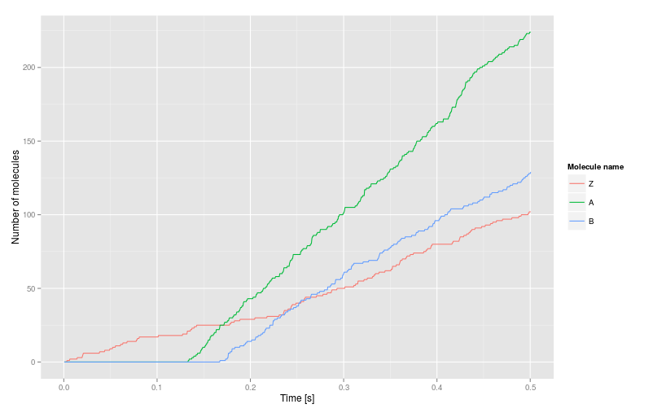

## Stochastic reactions

Allows to specify reaction rules that are stochastically being executed inside the cell or in surrounding environment around the cell.

> The syntax is similar to one in NFSim.

### Basic Syntax

Each reaction has 2 sides, first side gets consumed and second gets added when the reaction occurs.
This reaction changes molecule `A` to molecule `B`.
In other words, when this reaction occurs, one molecule `A` gets substracted and one molecule `B` gets added.

```
A > 1 > B;
```

Next reaction changes one molecule of type `A` into molecules `B` and `C`.

```
A > 1 > B + C;
```

Following reaction creates complex `C` from 2 molecules of `A`.
That means that at least two As are required for this reaction to occur.

```
A + A > 1 > C;
```

Keyword `null` means there is nothing on this side of reaction. Useful in simple expression or degradation reaction.
Reaction bellow represents expression of `C`.

```
null > 1 > C;
```

Similarly, this reaction represents degradation of `A`.

```
A > 5 > null;
```

### Environmental reactions

If you desire to have reactions which cooperate with diffusion simply add `env` keyword before molecule name.

> Requires properly set `diffusion` module with signals that have same name as molecules released into environment.

Representation of absorption:

```
env A > 1 > A;
```

Expression of molecule `A` is either represented using:

```
A > 1 > env;
```

or using:

```
null > 1 > env A;
```

Please note that those two representations are not exactly the same although they lead to the same result. In first example there must be molecule `A` present in the cell, after executing the reaction the molecule gets subtracted from the cell and added to the environment. Therefore this reaction represents transportation of molecule outside the cell. In second reaction, the molecule is added and released directly to the environment in single step.

### Reaction Rate

Each reaction has its reaction rate. Rate is located between the `>` symbols. Rate is number indicating how many times (on average) the reaction occurs during the time step. Following reaction has reaction rate 1.

```
A + A > 1 > C;
```

You dont have to enter whole number, you can enter any expression you desire. Following reaction has reaction rate 1.2.

```
A + A > 1 + 2 * 10.0e-2 > C;
```

Commonly used functions are supported too. (Complete list of supported functions is located bellow.)
Following reaction has reaction rate 1.

```
A + A > cos(0) > C;
```

You can use name of molecule in reaction rate area. By doing this you can use amount of molecules to calculate rate of reaction.
Rate of following reaction is equal to: (number of currently present molecules of C) + 2 * (number of currently present molecules of D)

```
A > C + 2 * D > B;
```

You can use similiar approach to access amount of molecules in surrounding environment.
Rate of next reaction is number of currently present molecules of A in environment around the cell.

```
B > env A > C;
```

These features can be combined to create complex rate functions.

#### List of built in functions

| Function    | Return value                   |
|-------------|--------------------------------|
| exp(x)      | Natural exponential function   |
| ln(x)       | Natural logarithm of x         |
| log10(x)    | Logarithm to the base 10 of x  |
| log2(x)     | Logarithm to the base 2 of x   |
| abs(x)      | Absolute value of x            |
| sgn(x)      | Signum function of x           |
| sqrt(x)     | Square root of x               |
| cbrt(x)     | Cubic root of x                |
| sin(x)      | Sine x                         |
| cos(x)      | Cosine x                       |
| tan(x)      | Tangent x                      |
| cot(x)      | Cotangent x                    |
| sec(x)      | Secant x                       |
| csc(x)      | Cosecant x                     |
| sinh(x)     | Hyperbolic sine x              |
| cosh(x)     | Hyperbolic cosine x            |
| tanh(x)     | Hyperbolic tangent x           |
| coth(x)     | Hyperbolic cotangent x         |
| sech(x)     | Hyperbolic secant x            |
| csch(x)     | Hyperbolic cosecant x          |
| asin(x)     | Inverse sine x                 |
| acos(x)     | Inverse cosine x               |
| atan(x)     | Inverse tangent x              |
| acot(x)     | Inverse cotangent x            |
| asec(x)     | Inverse secant x               |
| acsc(x)     | Inverse cosecant x             |
| asin(x)     | Inverse hyperbolic sine x      |
| acosh(x)    | Inverse hyperbolic cosine x    |
| atanh(x)    | Inverse hyperbolic tangent x   |
| acoth(x)    | Inverse hyperbolic cotangent x |
| asech(x)    | Inverse hyperbolic secant x    |
| acsch(x)    | Inverse hyperbolic cosecant x  |
| gamma(x)    | Gamma function                 |
| pow(x,y)    | x to the power of y            |
| log(x,y)    | Logarithm to the base x of y   |
| hill(x,y,z) | x^z / (x^z + y^z)              |

### Conditional reactions

If you need reaction to happen only when some other molecule is present, take a look at following reaction. This reaction subtracts `A` and `B`, and adds `C + B`. Therefore, this reaction changes `A` to `C` only when `B` is present.

```
A + B > 3 > C + B;
```

We introduce new keyword `if` which can be used to describe reactions which use this principle in an easy way.

```
if B: A > 3 > C;
```

Another useful keywords are `and`, `or` and `not` which can be used to create more complex condition.

```
if not C and D and E:  A + B > 1 > C;
```

You can combine as many logic combinations as you can.
Please note that `and` is prior to `or` by default. You can add parenthesis to make operation order clear.vNext reaction merges `A` and `B` into `C`, but this reaction can occur only when there is no molecule of `C` and simultaneously there must be `D` and `E` present in the cell.

```
if (A or B) and C: D > 1 > E;
```

Simple condition `if A` entee is more than 500 molecules of `B` present in the cell.

```
if B > 500: A > 1 > C;
```

It is possible to compare values of 2 molecules. Following reactions has chance of happening only when there is more molecules of `B` than `A`.

```
if B > A: D > 1 > C;
```

You can use any relative operator to compare values (>, <, <=, >=, =, !=).

#### Block condition

Sometimes more reactions have the same condition. You can simplify your reaction code using block condition.

```
if B > 500:
{
  D > 1 > C;
  F > 2 > E;
}
```

By doing this, your condition is applied to all reactions located between brackets.

### Reversible reactions

Lets say you have 2 reactions, one for expression and one fore degradation of molecule A.

```
A > 2 > null;
null > 5 > A;
```

The two reactions above can be easily rewritten like this using reversible reaction syntax.

```
A < 5, 2 > null;
```

or

```
null < 2, 5 > A;
```

First rate is rate of reaction going back, and second rate is for reaction going forward.

### Parameters

Reaction file allows you to define global parameters. You can import these parameters using keyword `par`.

```
if B > par Q: A > par T > C;
```

### Example:

Defines program that extensively use potential of Stochastic reaction plugin.

```xml
<parameter name="K1" value="20" />
<program name="make" language="stochastic-reactions"><![CDATA[
  # expression of Z
  null > 0.1 > Z;
  # block condition
  if Z > 20:
  {
    # expression and degradation of A - reversible reaction
    null < 0.5, 0.8 > A;
    # expression of C directly to environment
    null > 0.6 > env C;
  }
  # expression of B - conditional reaction with parameter, rate as expression
  if A > par K1: null > - ln( 0.5 ) / 3.69 > B;
  # degradation of B - conditional reaction comparing 2 molecules
  if B > A: B > 1 > null;
  # expression of GFP - condition with diffusion, rate as function of molecule
  if env C > 50uM: null > B > GFP;
]]></program>
```


